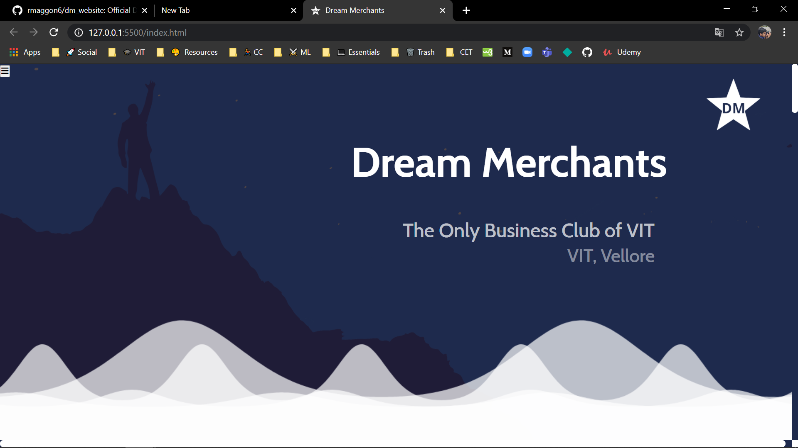
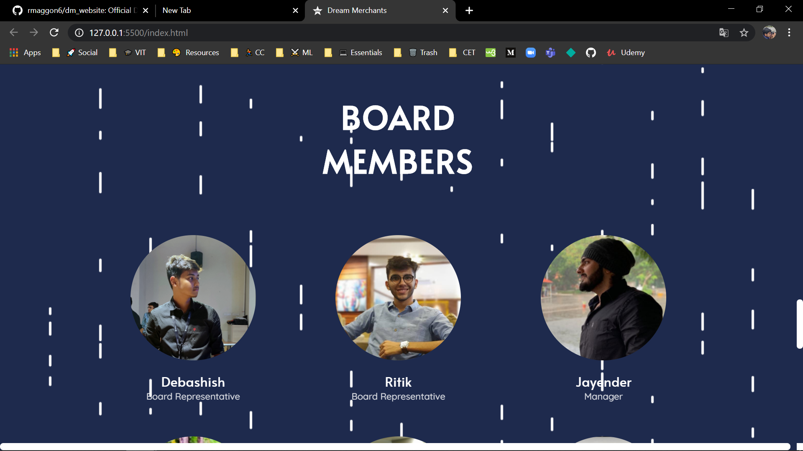

 

  

  <h3 align="center">Only Business Club of VIT </h3>

  

    <a href="#"><strong>Official Website »</strong></a>
     
     
    <a href="#">View Codes</a>
    ··
    <a href="#">Report Bug</a>
    ··
    <a href="#">Request Feature</a>
  

 

<!-- ABOUT THE PROJECT -->
## About The Project
 

 
    

 
    

Write the details here 

### Built With

* [HTML](https://getbootstrap.com)
* [CSS](https://jquery.com)
* [Javascript](https://laravel.com)

## Contributing

Contributions are what make the open source community such an amazing place to be learn, inspire, and create. Any contributions you make are **greatly appreciated**.

1. Fork the Project
2. Create your Feature Branch (`git checkout -b feature/AmazingFeature`)
3. Commit your Changes (`git commit -m 'Add some AmazingFeature'`)
4. Push to the Branch (`git push origin feature/AmazingFeature`)
5. Open a Pull Request

<!-- LICENSE -->
## License

Distributed under the MIT License. See `LICENSE` for more information.

## Contact me 

So connect with me and share your experience.

I would love to interact with this world full of amazing people such as you. 

 &nbsp;&nbsp; &nbsp;&nbsp;

	With :heart: by <a href="https://rakshit.netlify.app/" target="_blank">Rakshit Maggon</a>

